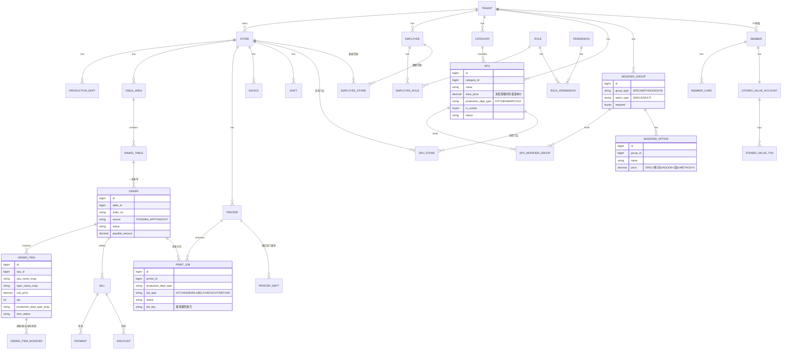
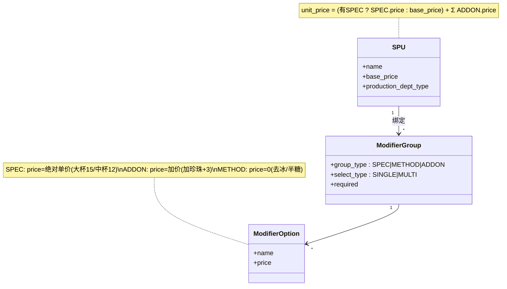
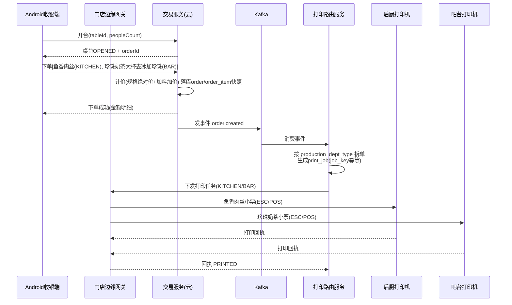
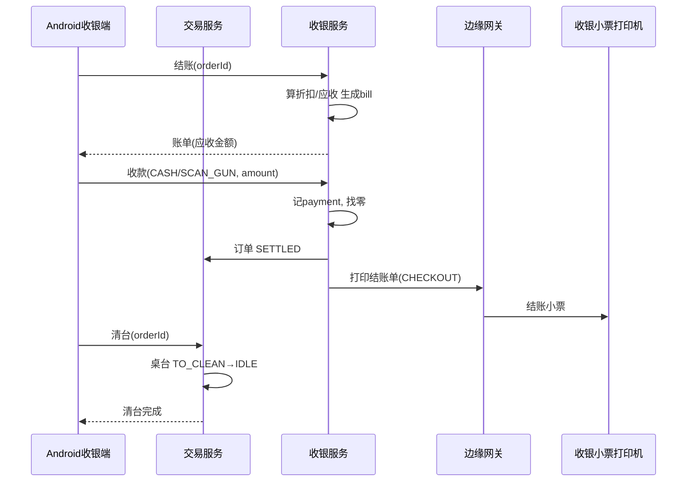
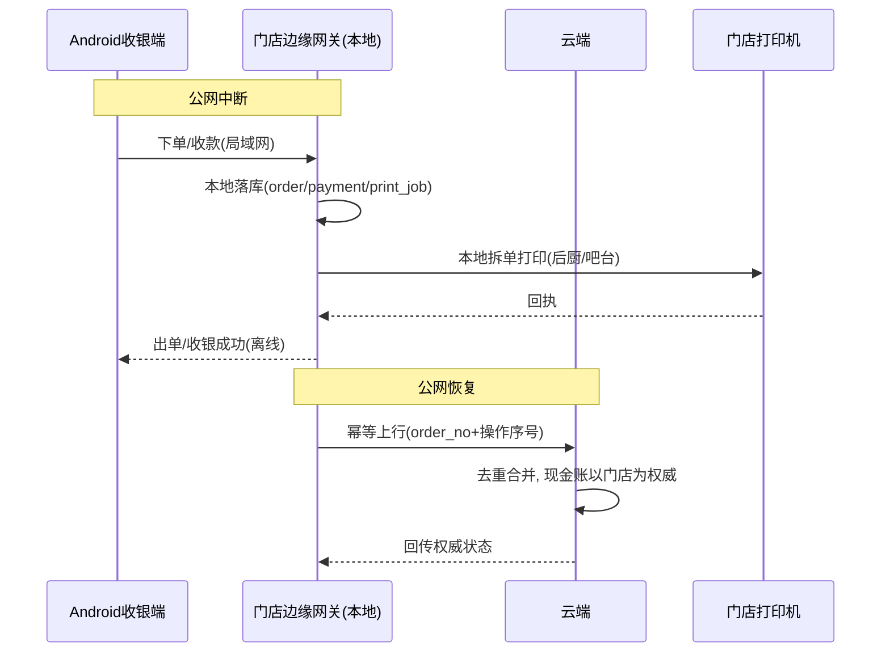
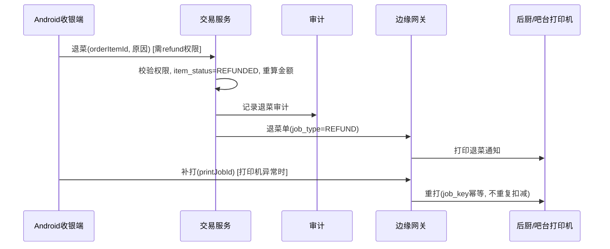
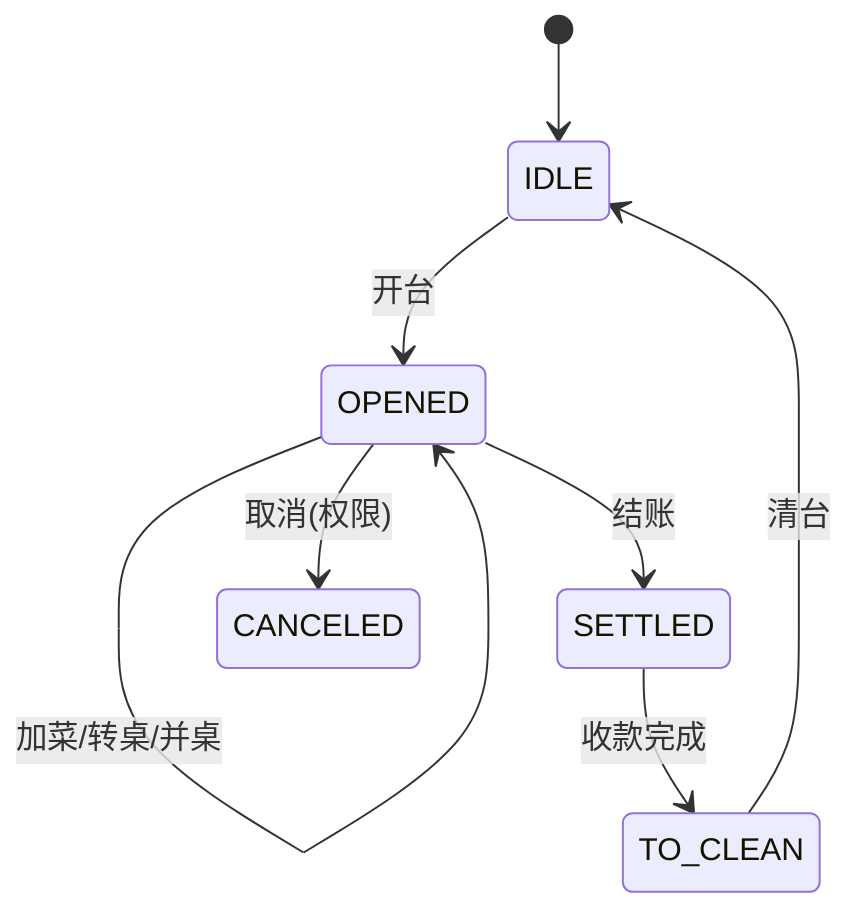

# 餐饮系统 V1.0 · 图形化设计（ER 图 + 关键流程时序图）

> 使用 Mermaid 绘制，GitHub / 支持 Mermaid 的 Markdown 查看器可直接渲染。
> 配套《餐饮系统_V1.0详细设计》。已采用决策：全国统一价、规格选项绝对价、出品部门按类型、品牌统一商户号、每店边缘网关、Go。

---

## 1. 实体关系图（ER）

---

## 2. 商品属性与计价模型（类图视角）

---

## 3. 时序图：开台 → 混合点单 → 分单打印

---

## 4. 时序图：结账 → 收银 → 清台

---

## 5. 时序图：弱网/离线 — 边缘网关兜底与同步

---

## 6. 时序图：退菜 + 补打

---

## 7. 状态机：桌台 / 订单

> 下一份将产出：完整接口清单 + 出入参 JSON 示例。
